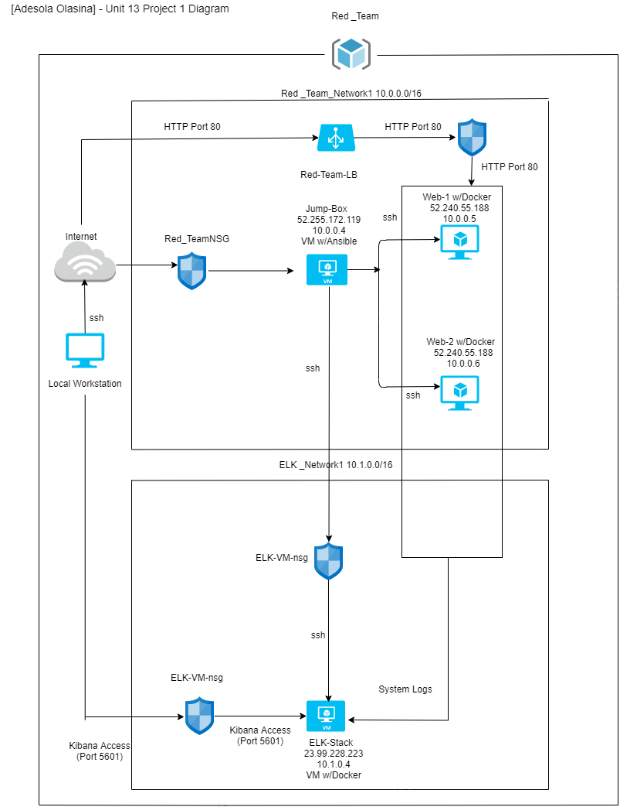

## Automated ELK Stack Deployment

The files in this repository were used to configure the network depicted below.

These files have been tested and used to generate a live ELK deployment on Azure. They can be used to either recreate the entire deployment pictured above. Alternatively, select portions of the filebeat-playbook.yml file may be used to install only certain pieces of it, such as Filebeat.

-[Filebeat-playbook.yml] is located: (Ansible/filebeat-playbook.yml)

This document contains the following details:
- Description of the Topology
- Access Policies
- ELK Configuration
- Beats in Use
- Machines Being Monitored
- How to Use the Ansible Build

### Description of the Topology

The main purpose of this network is to expose a load-balanced and monitored instance of DVWA, the D*mn Vulnerable Web Application.

Load balancing ensures that the application will be highly __functionable__, in addition to restricting __traffic__ to the network.
- The load balancer is crafted to distribute and optimize traffic or load among the virtual machines.  It serves as an extra layer of security while protecting apllications from threats. 
- Using the jump box as a gateway to other virtual machines will force traffic through a single node. This will allow for a more secure connection and easy way to manage connections between machines.  

Integrating an ELK server allows users to easily monitor the vulnerable VMs for changes to the __metrics__ and system __logs__.
- Filebeat is installed as an agent on the servers to monitor system log files to collect data while forwarding log events to elasticsearch.
- Metricbeat takes the metric and statistics that it collects and forwards the information to the output that is specied, in this case Elasticsearch/Kibana.  This will help to monitor servers.

The configuration details of each machine may be found below.
_Note: Use the [Markdown Table Generator](http://www.tablesgenerator.com/markdown_tables) to add/remove values from the table_.

| Name     | Function | IP Address | Operating System |
|----------|----------|------------|------------------|           
| Jumpbox | Gateway | 10.0.0.4 | Linux                 |   
| Web-1   | Server  | 10.0.0.5 | Linux w/DVWA Container|   
| Web-1   | Server  | 10.0.0.6 | Linux w/DVWA Container|   
| ELK-VM  | Server  | 10.1.0.4 | Linux w/DVWA Container|   

### Access Policies

The machines on the internal network are not exposed to the public Internet. 

Only the __Jump-Box-Provisioner__ machine can accept connections from the Internet. Access to this machine is only allowed from the following IP addresses:
- IP addresses 98.300.2.18

Machines within the network can only be accessed by __Jump-Box-Provisioner__.
- Jump-Box-Provisioner 52.170.192.207

A summary of the access policies in place can be found in the table below.

| Name     | Publicly Accessible | Allowed IP Addresses |
|----------|---------------------|----------------------| 
| Jump Box | Yes                 | 52.170.192.201       |
| Web-1    | No                  | 10.0.0.5             |
| Web-2    | No                  | 10.0.0.6             |
| ELK_VM   | Yes                 | 40.78.147.66         |

### Elk Configuration

Ansible was used to automate configuration of the ELK machine. No configuration was performed manually, which is advantageous because...
- Using Ansible for automating and configuring allows for daily task to be executed or deplyed on time, effortlessly and in order.  This will allow administrators to focus other other complex task at the same time being highly productive.   

The playbook implements the following tasks:
- Install docker.io
- Install python3-pip
- Install Docker module
- Increase virtual memory
- Download and launch a docker elk container

The following screenshot displays the result of running `docker ps` after successfully configuring the ELK instance.

- (Images/ELK Stack - Project 1 Images.pdf)

### Target Machines & Beats
This ELK server is configured to monitor the following machines: 
- Web-1: 10.0.0.5
- Web-2: 10.0.0.6

	
We have installed the following Beats on these machines:

- Filebeat
- Metricbeat

These Beats allow us to collect the following information from each machine:
- The Filebeat-7.4.0-amd/64.deb is used to forward and centralize log data.  Installed as an agent on the servers to monitor system log files to collect data while forwarding log events to elasticsearch.
- Metricbeats us used to collect information and metrics from services. 

### Using the Playbook
In order to use the playbook, you will need to have an Ansible control node already configured. Assuming you have such a control node provisioned: 

SSH into the control node and follow the steps below:
- Copy the __filebeat-playbook.yml__ file to __/etc/ansible/roles__.
- Update the __filebeat-playbool.yml__ file to include __the host as webservers to specifiy which machines _Web-1 and Web-2) and 5601 port to see if Kibana is running__. 
- Run the playbook, and navigate to __Kibana__ to check that the installation worked as expected.
 

- Use install-elk.yml to specify that the elk server will be downloaded and launched on a docker elk container (sebp/elk:761).  Use filebeat-playbook.yml to specify that the filebeat will be downloaded and installed on the host:servers machines (Webserver are Web-1 and Web-2).

- http://104.43.196.174:5601/app/kibana#/home/tutorial/systemLogs Is the URL do you navigate to in order to check that the ELK server is running.

As a **Bonus**, provide the specific commands the user will need to run to download the playbook, update the files, etc._

- ssh azdming@52.170.192.201 (Jump-Box-Provisioner IP Address)
- ssh-keygen
- curl https://gist.githubusercontent.com/slape/5cc350109583af6cbe577bbcc0710c93/raw/eca603b72586fbe148c11f9c87bf96a63cb25760/Filebeat > filebeat-config.yml
- curl https://gist.githubusercontent.com/slape/58541585cc1886d2e26cd8be557ce04c/raw/0ce2c7e744c54513616966affb5e9d96f5e12f73/metricbeat > metricbeat-config.yml
- sudo su
- Docker start xenodochial_davinci
- Docker attach xenodochial_davinci
- nano filebeat-config.yml (create/edit configuration file)
- nano metricbeat-config.yml (create/edit configuration file)
- nano install-elk.yml (create/edit configuration file)
- nano filebeat.yml (create/edit configuration file)
- nano metricbeat.yml (create/edit configuration file)
- ansible-playbook install-elk.yml (execute file)
- ansible-playbook filebeat-playbook.yml (execute file)
- ansible-playbook metricbeat-playbook.yml (execute file)